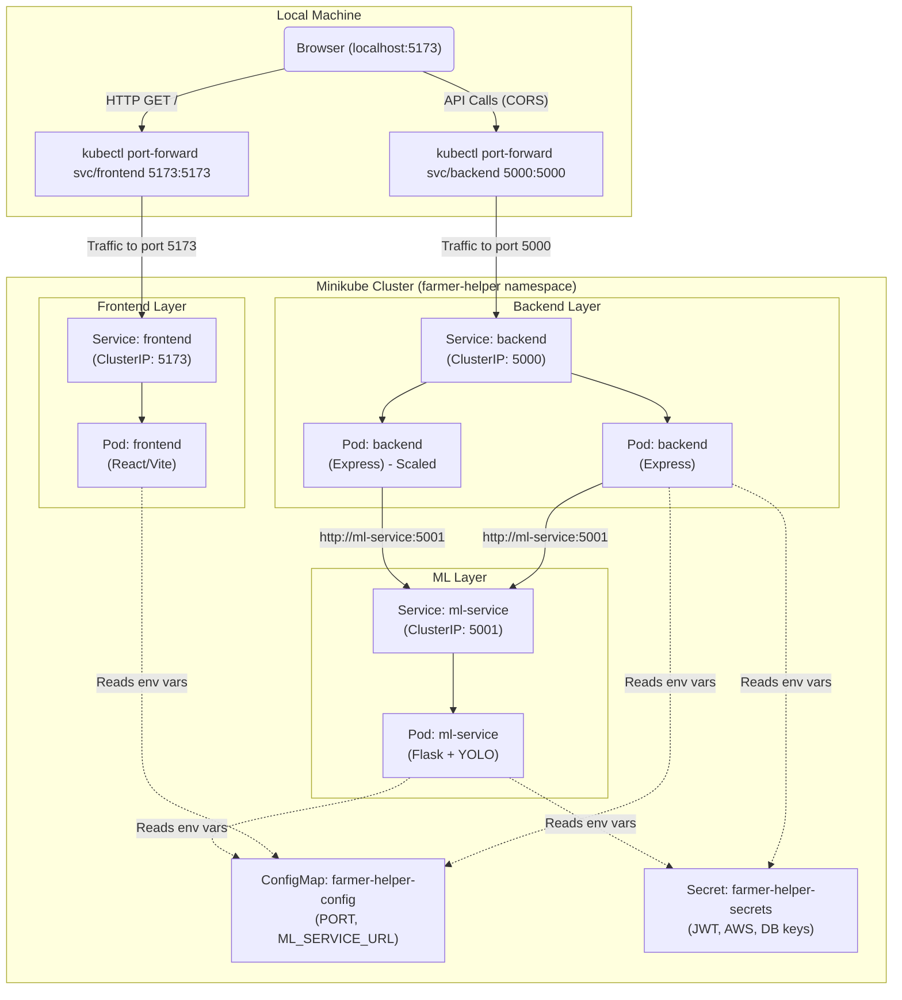

# Phase 5 — Kubernetes Deployment (Local)

## Architecture Overview

This phase migrates the Farmer Helper application from a `docker-compose` setup to a Kubernetes (K8s) cluster. We use **Minikube** to run a local cluster, leveraging the existing Docker Hub images built in Phase 1.

### Kubernetes Architecture: Control Plane vs. Worker Node

A Kubernetes cluster is divided into two main parts:

1.  **Control Plane (Master Node):** The brain of the cluster. It manages the cluster state, schedules applications, and responds to cluster events. Key components include:
    *   **kube-apiserver:** The front-end for the Kubernetes control plane. All communication goes through it.
    *   **etcd:** Consistent and highly-available key value store used as Kubernetes' backing store for all cluster data.
    *   **kube-scheduler:** Watches for newly created Pods with no assigned node, and selects a node for them to run on.
    *   **kube-controller-manager:** Runs controller processes (like Node controller, Job controller, Endpoints controller).
2.  **Worker Node:** The machines (virtual or physical) that actually run the applications (Pods). Key components include:
    *   **kubelet:** An agent that runs on each node in the cluster. It makes sure that containers are running in a Pod.
    *   **kube-proxy:** A network proxy that runs on each node in your cluster, implementing part of the Kubernetes Service concept (maintaining network rules).
    *   **Container Runtime:** The software that is responsible for running containers (e.g., Docker, containerd).

*In Minikube (running locally), both the Control Plane and a single Worker Node are typically packed into the same virtual machine or Docker container.*

---

## Farmer Helper Kubernetes Architecture Diagram

---

## Accessing the Application (Port Forwarding & CORS)

To access the application running inside the local Minikube cluster, we use `kubectl port-forward`.

*   **Frontend:** `kubectl port-forward svc/frontend 5173:5173 -n farmer-helper`
*   **Backend:** `kubectl port-forward svc/backend 5000:5000 -n farmer-helper`

**Why this approach?**
1.  **Simplicity for Local Dev:** It avoids the complexity of setting up an Ingress controller and modifying `/etc/hosts` for local DNS resolution.
2.  **CORS Compatibility:** The backend's `server.js` has a hardcoded CORS allowlist that includes `http://localhost:5173`. By port-forwarding both services to localhost on their respective ports, the frontend can make API calls to `http://localhost:5000` and the browser will accept them because the origins match the existing CORS configuration. No code changes are required.

The backend communicates with the ML service internally using the Kubernetes DNS name of the service: `http://ml-service:5001`. Kubernetes service names cannot contain underscores, so we use `ml-service` instead of `ml_service`.

---

## Deliverables Checklist

- [x] **Namespace:** `k8s/namespace.yaml`
- [x] **ConfigMap:** `k8s/configmap.yaml` (Shared config, non-sensitive)
- [x] **Secret:** `k8s/secret.yaml` (Placeholders for sensitive keys)
- [x] **Frontend:** `k8s/frontend/deployment.yaml` & `service.yaml`
- [x] **Backend:** `k8s/backend/deployment.yaml` & `service.yaml` (Includes liveness/readiness probes on `/health`)
- [x] **ML Service:** `k8s/ml-service/deployment.yaml` & `service.yaml` (Generous liveness/readiness probes for S3 model download)
- [x] **Demo Script:** `k8s/demo.sh` (Interactive script for applying manifests, scaling, self-healing, and port-forwarding)
- [x] **Documentation:** This file (`docs/phase5-kubernetes.md`)
